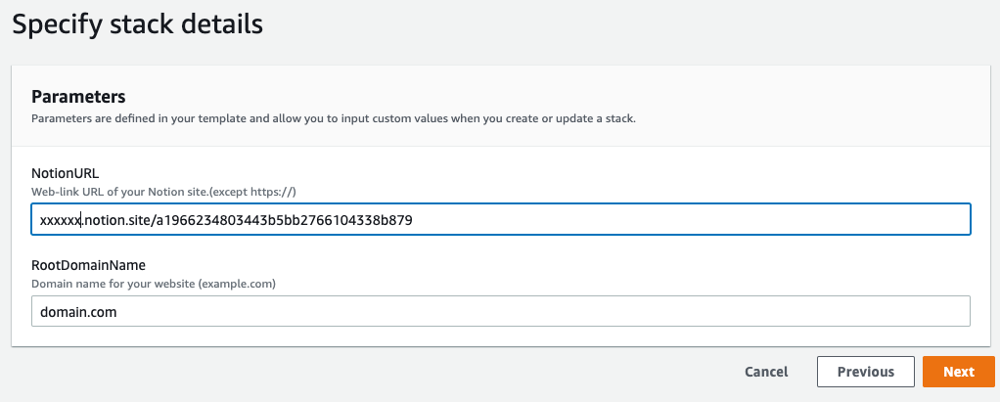

# cfn-notion-custom-domain-with-route53
Redirect a route53 domain to a Notion page
# Features Summanry
- Redirect the custom domain registered in the hosted zone on route53 to the notion page.
    - your-domain.com
    - www.your-domain.com
- Support "HTTPS"

# Prerequisites

- URL of notion page(Share > copy address web-link)
- Your custom domain on route53(Hosted zone name will be "your-domain.com")

# Deploy the solution

To deploy the solution, you use [AWS CloudFormation](https://aws.amazon.com/cloudformation). You can use the CloudFormation console, or download the CloudFormation template to deploy it on your own.

> **Note:** You must have IAM permissions to launch CloudFormation templates that create IAM roles, and to create all the AWS resources in the solution. Also, you are responsible for the cost of the AWS services used while running this solution. For more information about costs, see the pricing pages for each AWS service.

## Use the CloudFormation console

**To deploy the solution using the CloudFormation console**

1. Click the **Launch on AWS** button to open the solution in the CloudFormation console.

    

2. If necessary, sign in with your AWS account credentials.
3. You should see a **Create stack** page, with pre-populated fields that specify the CloudFormation template. Choose the **Next** button at the bottom of the page.
4. On the **Specify stack details** page, enter values for the
   following fields:

    - **RootDomainName:** Your registered domain name, such as example.com. This domain must be pointed to a Route 53 hosted zone.
    - **NotionURL** The Notion web link url containing the domain being used.

   After entering values, choose the **Next** button.
5. On the **Configure stack options** page, you can optionally [add tags and other stack options](https://docs.aws.amazon.com/AWSCloudFormation/latest/UserGuide/cfn-console-add-tags.html). When finished, choose the **Next** button.
6. On the **Review** page, you must scroll down and check the two boxes in the **Capabilities** section:

    - **I acknowledge that AWS CloudFormation might create IAM resources with custom names.**
    - **I acknowledge that AWS CloudFormation might require the following capability: CAPABILITY_AUTO_EXPAND**

    These capabilities allow CloudFormation to create an IAM role that allows access
   to the stack’s resources, and to name the resources dynamically.
7. Choose the **Create stack** button.
8. Wait for the CloudFormation stack to launch. The stack launches some nested stacks, and can take several minutes to finish. When it’s launched, the **Status** changes to **CREATE_COMPLETE**.
9. After the stack is launched, go to **www.example.com** to view your website (replace **example.com** with your domain name). You should see the website’s default content:

### Download the CloudFormation template

To download the CloudFormation template to deploy on your own, go to: [Download](main/main.yml)

